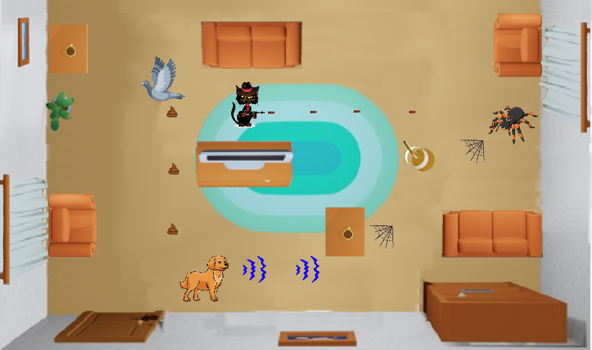
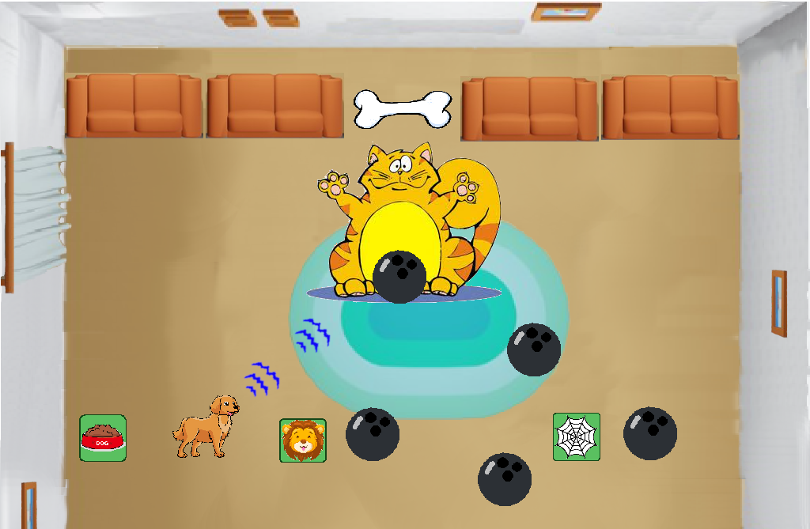

# Bone Rescue Game
A 2D game for educational purpose built-in c++, using the SFML library

This game is about a golden retriever dog whose main objective is to recover its bone, the protagonist will run through a large living room to reach its price (a bone), however, the animal will have to sort several obstacles such as armchairs, lamps, tables, etc. Another level of difficulty are enemies, they are spiders, doves, cats, and final boss that is a big cat who throw bowling balls. 

Map scrolling will be top/down, nevertheless, once the maximum top is reached the screen will keep in that position until the boss is defeated or the dog loses its all health. The main character will have roar powers, which will be 3 waves in mouse direction. They could beat enemies. In addition some pawer ups will be left randomly by enemies to help the protagonist to rescue its bone.

##Overview

A summary of the gameplay is showed in the next picture, it includes almost all characters, powers, and obstacles. As the player is going up bullets (dove-po, cat-bullet, web) speed increases.  

The following image illustrates the final stage, final boss appears there, in addition all power-ups, bowling ball behaviour, and price. 

##Main Character

##Sketch of Main Character

##Opponents

##Sketch of Opponents

##Environment

##Sketch of World
The map is the living room where Dog’s family live where you can find some furniture as obstacle. 

##Menus
Main menu with 3 levels of difficulty to choose

##Controls
Arrow top
Arrow bottom
Arrow left
Arrow right
Space
Escape
P key
Q key
E key 

##Sounds
When a gun hit an enemy

##Summary

