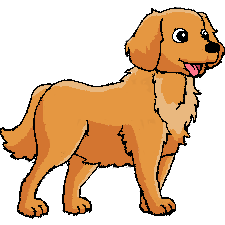
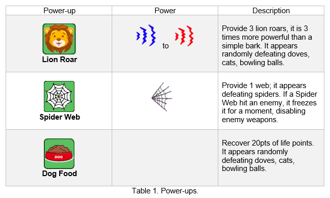
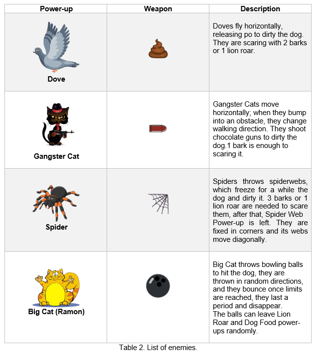
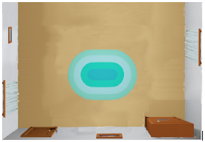
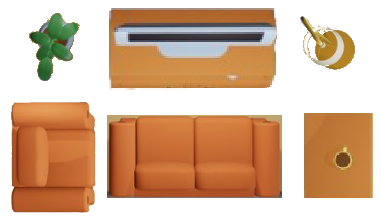

# Bone Rescue Game

A 2D game for educational purpose built-in c++, using the SFML library.

This game is about a golden retriever dog whose main objective is to recover its bone, the protagonist will run through a large living room to reach its prize (a bone), however, the animal will have to sort several obstacles such as armchairs, lamps, tables, etc. Another level of difficulty are enemies, they are spiders, doves, cats, and final boss that is a big cat who throw bowling balls. 

Map scrolling will be top/down, nevertheless, once the maximum top is reached the screen will keep in that position until the boss is defeated, or the dog loses its all health. The main character will have roar powers, which will be 3 waves in mouse direction. They could beat enemies. In addition, some pawer ups will be left randomly by enemies to help the protagonist to rescue its bone.

## Overview

A summary of the gameplay is showed in the next picture (Figure 1), it includes almost all characters, powers, and obstacles. As the player is going up bullets (dove-po, cat-bullet, web) speed increases.   

Figure 1. Gameplay Example.

The following image (Figure 2) illustrates the final stage, final boss appears there, in addition all power-ups, bowling ball behaviour, and prize. 

Figure 2. Final Stage.

## Main Character

The protagonist of the game is a golden retrieve dog whose name is Samira (Figure 3). The dog can bark to hit enemies; during the game, the main character can find some power-ups (Table 1) that stronger its roar, recover its life, and wrap enemies to freeze them. It is a third person game.

Table 1. Power-ups.

Samira is a lovely dog whose prize (bone) was kidnapped by the house’s cat and its collaborators. 
She is the youngest pet in the house for that reason she receives more attention, that is way her prize was kidnapped by the cat. She needs to keep clean her reputation as house guardian, being clean, scaring outsider, controlling the big cat (Ramon), and recovering her bone.

## Enemies

In Table 2, all enemies will be listed.

Table 2. List of enemies.

Ramon was the unique pet within the family for 6 years until Samira was adopted. He felt that he was ignored, for that reason, Ramon changed his name to Big Cat and organized the plan to damage Samira reputation.  

## Environment

The map is a large living room (Figure 4) full of obstacles (Figure 5) and enemies, the first stage is top / down scenario; once the player reaches the maximum top scroll, the final stage keep fix until dog wins of is defeated.

Figure 4. Example of the map view.

Figure 5. All possible obstacles.

## Sketch of World

The Big Cat took the house's living room as a battlefield because it was the best place to prepare the traps. Also, it is the perfect place to get dirty and guilt Samira for that. 

## Menus

Main menu with 3 levels of difficulty to choose.

## Controls

| Key | Action |
| ----------- | ----------- |
| Top Arrow | Go Top |
| Bottom Arrow | Go Down |
| Left Arrow | Go Left |
| Right Arrow | Go Right |
| Space | Bark |
| Escape | Return to menu |
| P | Pause Game |
| Q | Quit Game |
| E | Lion Roar |
| W | Spider Web |
| Enter | Enter to the game |
| Mouse cursor | Address bark direction |

## Sounds

- Hit a normal enemy.
- Hit the Big Cat.
- Releasing Dove po.
- Throwing bowling ball.
- Bark.
- Lion Roar. 
- Shooting chocolate gun.
- Shooting spiderweb.
- Dog being hit.
- Game Music.
- Menu Music.
- Taking a power-up.

## Summary

Bone Rescue is a perfect game for kids and dog lovers; it is easy to understand the controls and game goals. This game contains three levels of difficulty for people that want more challenges. If you are looking for a way to entertain your nephews, meanwhile you are working, Bonce rescue is your best choice.